# Content Editor (`ceditor`) Package Documentation

> **Package:** `org.olat.modules.ceditor`
> **Source root:** `src/main/java/org/olat/modules/ceditor/`
> **Purpose:** Provides the block-based content editor used across OpenOlat for portfolio pages and evaluation forms. Authors compose pages by adding, arranging, and configuring typed content elements (titles, paragraphs, code blocks, images, containers, etc.) through an in-browser WYSIWYG editor.

---

## Table of Contents

1. [Overview and Purpose](#1-overview-and-purpose)
2. [Core Domain Model](#2-core-domain-model)
3. [JPA Persistence Model](#3-jpa-persistence-model)
4. [Settings Serialization (ContentEditorXStream)](#4-settings-serialization-contenteditorxstream)
5. [Handler Pattern](#5-handler-pattern)
6. [Provider Pattern (PageEditorProvider SPI)](#6-provider-pattern-pageeditorprovider-spi)
7. [UI Architecture and Rendering Pipeline](#7-ui-architecture-and-rendering-pipeline)
8. [Event System](#8-event-system)
9. [Service Layer and Persistence](#9-service-layer-and-persistence)
10. [Container and Layout System](#10-container-and-layout-system)
11. [Element Type Reference](#11-element-type-reference)
12. [Adding a New Element Type (Step-by-Step)](#12-adding-a-new-element-type-step-by-step)
13. [Client-Side Integration](#13-client-side-integration)
14. [Configuration](#14-configuration)
15. [Markdown and Word Import](#15-markdown-and-word-import)
16. [AI Question Generation on Import](#16-ai-question-generation-on-import)

---

## 1. Overview and Purpose

The `ceditor` package implements a **server-centric block-based content editor**. Every page is a flat, ordered list of **PagePart** rows in a single database table. The editor renders each part as a visual block that can be edited inline, rearranged via drag-and-drop, configured through an inspector panel, and nested inside layout containers.

### Key design principles

- **Server-side state:** All editing state lives on the server. The browser receives HTML fragments via AJAX. There is no client-side framework; drag-and-drop uses the lightweight `dragula.js` library.
- **Handler/Provider SPI:** New element types are introduced by implementing a `PageElementHandler`. The embedding context (portfolio, evaluation form) provides a `PageEditorProvider` that controls which handlers are available and how elements are persisted.
- **Single-table inheritance:** All concrete page parts are stored in one database table (`o_ce_page_part`) using JPA single-table inheritance with a discriminator column.
- **Dual storage columns:** Each part has a `content` column for primary data (HTML text, structured XML) and a `layoutOptions` column for XStream-serialized settings objects.
- **Three-part UI per element:** Each element in edit mode has up to three components -- a view part (read-only rendering), an editor part (inline editing), and an inspector part (side-panel settings).

### Package structure

```
ceditor/
  *.java                    # Core interfaces and enums (~39 files)
  handler/                  # PageElementHandler implementations (12 files)
  manager/                  # Service layer, DAO, file storage, markdown import (23 files)
  model/                    # Domain model interfaces and value objects (~49 files)
  model/jpa/                # JPA entity classes (24 files)
  ui/                       # Controllers, run components (~52 files)
  ui/component/             # Custom UI components and renderers (16 files)
  ui/event/                 # Event classes (29 files)
```

Templates (`*.html` Velocity files) live in `ui/_content/` subdirectories. i18n files (`LocalStrings_XX.properties`) live in `ui/_i18n/` subdirectories.

---

## 2. Core Domain Model

### Interface hierarchy

```
PageElement                          # Minimal identity: getId(), getType()
  +-- PagePart                       # Persistable part with content, layout, storage
        +-- [model interfaces]       # TitleElement, HTMLElement, ContainerElement, ...
              +-- [JPA entities]     # TitlePart, ParagraphPart, ContainerPart, ...
```

### PageElement

The root interface. Every piece of content on a page implements this.

```java
// File: PageElement.java
public interface PageElement {
    public String getId();    // Unique identifier (typically the DB key as string)
    public String getType();  // Type discriminator, e.g. "htitle", "htmlparagraph", "container"
}
```

### PagePart

Extends `PageElement` with persistence, content storage, and lifecycle hooks.

```java
// File: PagePart.java
public interface PagePart extends PageElement {
    Long getKey();                          // JPA primary key

    String getContent();                    // Primary content (HTML, XML, etc.)
    void setContent(String content);

    String getLayoutOptions();              // XStream XML settings blob
    void setLayoutOptions(String options);

    String getStoragePath();                // VFS sub-path for binary data
    void setStoragePath(String storagePath);

    Flow getPartFlow();                     // block or inline rendering
    void setPartFlow(Flow flow);

    PagePart copy();                        // Shallow copy for cloning
    boolean afterCopy(PagePart oldPart);    // Post-copy hook (e.g., copy media references)
    void beforeDelete();                    // Pre-deletion cleanup hook
}
```

### Flow

```java
public enum Flow {
    block,   // rendered like a <div>
    inline   // rendered like a <span>
}
```

### RenderingHints

Passed to handlers to control rendering behavior.

```java
public interface RenderingHints {
    public boolean isToPdf();             // Rendering for PDF export
    public boolean isOnePage();           // Single-page mode
    public boolean isExtendedMetadata();  // Show extended metadata
    public boolean isEditable();          // Editor is active (show placeholders etc.)
}
```

The standard implementation is `StandardMediaRenderingHints`, which defaults `isToPdf()`, `isOnePage()`, and `isExtendedMetadata()` to `false`.

### PageElementCategory

Categorizes element types in the "add element" dialog.

```java
public enum PageElementCategory {
    text("category.text"),
    questionType("category.question.type"),
    organisational("category.organisational"),
    media("category.media"),
    knowledge("category.knowledge"),
    other("category.other"),
    content("category.content"),
    layout("category.layout");
}
```

### Page and PageBody

A `Page` represents a content page with metadata (title, summary, status, poster image). It owns a `PageBody`, which in turn owns an ordered list of `PagePart` instances.

```
Page (o_ce_page)
  |-- title, summary, status, editable, version
  |-- FK -> PageBody (o_ce_page_body)
  |-- FK -> Group (base group for permissions)
  |-- FK -> Section (optional portfolio section)

PageBody (o_ce_page_body)
  |-- usage count, synthetic status
  |-- @OneToMany -> List<PagePart> (ordered by `pos` column, orphanRemoval=true)
```

---

## 3. JPA Persistence Model

### Table: `o_ce_page_part` (Single-table inheritance)

All page parts share one table. The JPA discriminator column selects the concrete subclass.

**AbstractPart** (`model/jpa/AbstractPart.java`):

```java
@Entity(name="cepagepart")
@Table(name="o_ce_page_part")
@DiscriminatorColumn
public abstract class AbstractPart implements Persistable, ModifiedInfo, CreateInfo, PagePart {
    @Id @GeneratedValue(strategy = GenerationType.IDENTITY)
    private Long key;

    private Date creationDate;
    private Date lastModified;

    @Column(name="pos", insertable=false, updatable=false)  // read-only order column
    private long pos;

    @Column(name="p_content")       // primary content
    private String content;

    @Column(name="p_flow")          // "block" or "inline"
    private String flow;

    @Column(name="p_layout_options") // XStream XML for settings
    private String layoutOptions;

    @Column(name="p_storage_path")   // VFS sub-path
    private String storagePath;

    @ManyToOne(fetch=FetchType.LAZY)
    @JoinColumn(name="fk_page_body_id")
    private PageBody body;
}
```

### Concrete part entities

| Entity / Discriminator     | Type String        | JPA Entity Name        | Model Interface     |
|----------------------------|--------------------|------------------------|---------------------|
| `TitlePart`                | `"htitle"`         | `cetitlepart`          | `TitleElement`      |
| `ParagraphPart`            | `"htmlparagraph"`  | `ceparagraphpart`      | `HTMLElement`       |
| `HTMLPart`                 | `"htmlraw"`        | `cehtmlpart`           | `HTMLRawElement`    |
| `SpacerPart`               | `"hr"`             | `ceseparatorpart`      | (none, extends AbstractPart directly) |
| `ContainerPart`            | `"container"`      | `cecontainerpart`      | `ContainerElement`  |
| `TablePart`                | `"table"`          | `cetablepart`          | `TableElement`      |
| `MediaPart`                | (dynamic from media) | `cemediapart`        | `ImageElement`      |
| `GalleryPart`              | `"gallery"`        | `cegallerypart`        | `GalleryElement`    |
| `ImageComparisonPart`      | `"imagecomparison"` | `ceimagecomparisonpart` | `ImageComparisonElement` |
| `CodePart`                 | `"code"`           | `cecodepart`           | `CodeElement`       |
| `MathPart`                 | `"math"`           | `cemathpart`           | `MathElement`       |
| `QuizPart`                 | `"quiz"`           | `cequizpart`           | `QuizElement`       |
| `EvaluationFormPart`       | `"evaluationform"` | `ceformpart`           | (none)              |
| `TocPart`                  | `"toc"`            | `cetocpart`            | `TocElement`        |

### Table: `o_ce_page`

```java
@Entity(name="cepage")
@Table(name="o_ce_page")
public class PageImpl implements Page {
    private Long key;
    private String title, summary, status;
    private boolean editable;
    private int version;
    private Date initialPublicationDate, lastPublicationDate;
    private String imagePath, imageAlign, previewPath;
    // FK references:
    private PageBody body;         // fk_body_id
    private Group baseGroup;       // fk_group_id
    private Section section;       // fk_section_id (optional, for portfolio)
    private VFSMetadata previewMetadata; // fk_preview_metadata
}
```

### Table: `o_ce_page_body`

```java
@Entity(name="cepagebody")
@Table(name="o_ce_page_body")
public class PageBodyImpl implements PageBody {
    private Long key;
    private int usage;
    private String syntheticStatus;

    @OneToMany(targetEntity=AbstractPart.class, mappedBy="body",
               orphanRemoval=true, cascade={CascadeType.REMOVE})
    @OrderColumn(name="pos")
    private List<PagePart> parts;
}
```

The `@OrderColumn(name="pos")` annotation on `PageBodyImpl.parts` is the mechanism that maintains element ordering. JPA manages the `pos` column automatically when elements are added, removed, or reordered in the list.

### Important JPA notes

- New entities must be registered in `META-INF/persistence.xml`.
- `AbstractPart.pos` is read-only (`insertable=false, updatable=false`) -- it exists only for `ORDER BY` in native queries. The actual ordering is managed by the `@OrderColumn` on `PageBodyImpl.parts`.
- `MediaPart` has additional FK columns (`fk_media_id`, `fk_media_version_id`, `fk_identity_id`) linking to the `cemedia` module.

---

## 4. Settings Serialization (ContentEditorXStream)

`ContentEditorXStream` is a centralized XStream wrapper that serializes/deserializes settings objects to/from XML. It enforces XStream security via `ExplicitTypePermission` -- only explicitly registered classes can be deserialized.

```java
// File: ContentEditorXStream.java
public class ContentEditorXStream {
    public static String toXml(Object obj);
    public static <U> U fromXml(String xml, Class<U> cl);
}
```

### Dual storage pattern

Each `PagePart` has two storage columns:

| Column           | Purpose                                    | Example Content                        |
|------------------|--------------------------------------------|----------------------------------------|
| `p_content`      | Primary data: HTML text or structured data | `"<h3>My Title</h3>"` or `TableContent` XML |
| `p_layout_options` | Settings/configuration as XStream XML    | `TitleSettings`, `CodeSettings`, `ContainerSettings` |

### Registered settings classes

All settings classes live in `org.olat.modules.ceditor.model`:

| Settings Class              | XStream Alias               | Used By         | Key Fields                                                     |
|-----------------------------|-----------------------------|-----------------|----------------------------------------------------------------|
| `TitleSettings`             | `titlesettings`             | TitlePart       | `size` (1-6), `layoutSettings`                                 |
| `TextSettings`              | `textsettings`              | ParagraphPart   | (text-specific settings)                                       |
| `CodeSettings`              | `codesettings`              | CodePart        | `codeLanguage`, `lineNumbersEnabled`, `displayAllLines`, `numberOfLinesToDisplay` |
| `TableSettings`             | `tablesettings`             | TablePart       | `rowHeaders`, `columnHeaders`, `striped`, `bordered`           |
| `TableContent`              | `tablecontent`              | TablePart       | `List<TableRow>` containing `List<TableColumn>`                |
| `ContainerSettings`         | `containersettings`         | ContainerPart   | `numOfColumns`, `type` (ContainerLayout), `List<ContainerColumn>` |
| `ImageSettings`             | `imagesettings`             | MediaPart       | alignment, size, title position                                |
| `GallerySettings`           | `gallerysettings`           | GalleryPart     | gallery type                                                   |
| `ImageComparisonSettings`   | `imagecomparisonsettings`   | ImageComparisonPart | orientation, comparison type                               |
| `MathSettings`              | `mathsettings`              | MathPart        | (LaTeX-specific)                                               |
| `QuizSettings`              | `quizsettings`              | QuizPart        | `List<QuizQuestion>`                                           |
| `TocSettings`               | `tocsettings`               | TocPart         | `title`, `visibleLevels` (Set&lt;Integer&gt; of 1-5, default 1-4)   |
| `BlockLayoutSettings`       | `blocklayoutsettings`       | (shared)        | `spacing`, custom spacing per side                             |
| `AlertBoxSettings`          | `alertboxsettings`          | (shared)        | `showAlertBox`, `type`, `title`, `withIcon`, `collapsible`     |
| `MediaSettings`             | `mediasettings`             | MediaPart       | (media-specific)                                               |
| `GeneralStyleSettings`      | `generalstylesettings`      | (shared)        | (general CSS settings)                                         |

### Example: reading and writing settings

```java
// Reading settings from a TitlePart
TitlePart titlePart = ...;
TitleSettings settings = ContentEditorXStream.fromXml(
    titlePart.getLayoutOptions(), TitleSettings.class);

// Modifying and saving back
settings.setSize(2);
titlePart.setLayoutOptions(ContentEditorXStream.toXml(settings));
pageService.updatePart(titlePart);
```

### Adding a new settings class

When adding a new settings class, you must:

1. Create the class in `org.olat.modules.ceditor.model`.
2. Add it to the `types` array in `ContentEditorXStream`'s static initializer.
3. Register an alias: `xstream.alias("youralias", YourSettings.class);`.

---

## 5. Handler Pattern

A `PageElementHandler` is the central extension point for each element type. It acts as a factory for the three UI parts (view, editor, inspector) and defines type metadata.

### PageElementHandler interface

```java
// File: PageElementHandler.java
public interface PageElementHandler {
    public String getType();            // Must match PagePart.getType()
    public String getIconCssClass();    // CSS icon class for the add-element dialog
    public PageElementCategory getCategory(); // Grouping in the add dialog
    public int getSortOrder();          // Order within category (lower = first)

    // Create the read-only view component
    public PageRunElement getContent(UserRequest ureq, WindowControl wControl,
                                     PageElement element, RenderingHints options);

    // Create the inline editor controller (nullable)
    public Controller getEditor(UserRequest ureq, WindowControl wControl, PageElement element);

    // Create the inspector side-panel controller (nullable)
    public PageElementInspectorController getInspector(UserRequest ureq, WindowControl wControl,
                                                        PageElement element);
}
```

### Mixin interfaces

Handlers combine `PageElementHandler` with one or more of these interfaces:

| Interface                        | Purpose                                         | Key Method                                          |
|----------------------------------|------------------------------------------------ |-----------------------------------------------------|
| `SimpleAddPageElementHandler`    | Creates element without user interaction         | `PageElement createPageElement(Locale locale)`       |
| `InteractiveAddPageElementHandler` | Needs a dialog to create (e.g., media upload) | `PageElementAddController getAddPageElementController(...)` |
| `CloneElementHandler`            | Supports duplicating elements                   | `PageElement clonePageElement(PageElement element)`  |
| `PageElementStore<U>`           | Saves modified elements via the handler          | `U savePageElement(U element)`                       |
| `PageLayoutHandler`             | Marks a handler as a layout/container type       | `ContainerLayout getLayout()`                        |

### Supporting controller interfaces

| Interface                          | Purpose                                           |
|------------------------------------|---------------------------------------------------|
| `PageRunElement`                   | Wraps a `Component` for read-only rendering; has `validate()` |
| `PageElementEditorController`      | Marker interface extending `Controller`            |
| `PageElementInspectorController`   | Extends `Controller`, adds `String getTitle()`     |
| `PageElementAddController`         | Dialog controller for interactive element creation |

### Canonical example: TitlePageElementHandler

```java
// File: handler/TitlePageElementHandler.java
public class TitlePageElementHandler implements PageElementHandler,
        PageElementStore<TitleElement>,
        SimpleAddPageElementHandler,
        CloneElementHandler {

    @Override public String getType()         { return "htitle"; }
    @Override public String getIconCssClass() { return "o_icon_header"; }
    @Override public PageElementCategory getCategory() { return PageElementCategory.text; }
    @Override public int getSortOrder()       { return 10; }

    @Override
    public PageRunElement getContent(UserRequest ureq, WindowControl wControl,
                                     PageElement element, RenderingHints options) {
        // Cast to TitlePart, read settings, build HTML, wrap in TextRunComponent
        if (element instanceof TitlePart titlePart) {
            TitleSettings settings = titlePart.getTitleSettings();
            String html = TitleElement.toHtml(titlePart.getContent(), settings);
            TextComponent cmp = TextFactory.createTextComponentFromString(..., html, ...);
            return new TextRunComponent(cmp, false);
        }
        return null; // should not happen
    }

    @Override
    public PageElementEditorController getEditor(UserRequest ureq, WindowControl wControl,
                                                  PageElement element) {
        if (element instanceof TitlePart titlePart) {
            return new TitleEditorController(ureq, wControl, titlePart, this, false);
        }
        return null;
    }

    @Override
    public PageElementInspectorController getInspector(UserRequest ureq, WindowControl wControl,
                                                        PageElement element) {
        if (element instanceof TitlePart titlePart) {
            return new TitleInspectorController(ureq, wControl, titlePart, this, false);
        }
        return null;
    }

    @Override
    public PageElement createPageElement(Locale locale) {
        TitlePart title = new TitlePart();
        TitleSettings settings = new TitleSettings();
        settings.setSize(3);
        settings.setLayoutSettings(BlockLayoutSettings.getPredefined());
        title.setTitleSettings(settings);
        return title;
    }

    @Override
    public PageElement clonePageElement(PageElement element) {
        if (element instanceof TitlePart titlePart) {
            return titlePart.copy();  // AbstractPart.copy() copies content, layout, flow, storagePath
        }
        return null;
    }

    @Override
    public TitleElement savePageElement(TitleElement element) {
        return CoreSpringFactory.getImpl(PageService.class).updatePart((TitlePart) element);
    }
}
```

### Handler registration

Handlers are **not** Spring beans. They are instantiated directly by the `PageEditorProvider` implementation. Each provider decides which handlers to create and register.

---

## 6. Provider Pattern (PageEditorProvider SPI)

The `PageEditorProvider` is the **integration point** between the content editor and its embedding context (portfolio pages, evaluation forms, etc.). It acts as an adapter over the `PageService` for a specific page.

### Interface hierarchy

```java
// File: PageProvider.java
public interface PageProvider {
    List<? extends PageElement> getElements();          // Current parts on the page
    List<? extends PageElementHandler> getAvailableHandlers(); // All handlers (for rendering)
}

// File: PageEditorProvider.java (extends PageProvider)
public interface PageEditorProvider extends PageProvider {
    RepositoryEntry getBasRepositoryEntry();

    List<PageElementHandler> getCreateHandlers();       // Handlers shown in "add element" dialog
    List<PageLayoutHandler> getCreateLayoutHandlers();  // Layout handlers shown in "add layout" dialog

    int indexOf(PageElement element);
    String getAppendRejectionKey(String type);          // null = allowed; i18n key = rejection message

    PageElement appendPageElement(PageElement element);
    PageElement appendPageElementAt(PageElement element, int index);

    boolean isRemoveConfirmation(PageElement element);
    String getRemoveConfirmationI18nKey();
    void removePageElement(PageElement element);

    void moveUpPageElement(PageElement element);
    void moveDownPageElement(PageElement element);
    void movePageElement(PageElement elementToMove, PageElement sibling, boolean after);

    String getImportButtonKey();                        // null = no import button
    default boolean isImportMarkdownEnabled() { return false; } // show markdown import button
}
```

### Existing implementations

1. **`PortfolioPageEditorProvider`** -- inner class in `PageRunController` (portfolio module). Registers all content handlers plus media handlers from `MediaService`. This is the most feature-complete provider.

2. **`FormPageEditorProvider`** -- inner class in `EvaluationFormEditorController` (forms module). Registers a subset of handlers appropriate for form building.

### Typical provider implementation pattern

```java
private class MyPageEditorProvider implements PageEditorProvider {

    private final List<PageElementHandler> handlers = new ArrayList<>();
    private final List<PageElementHandler> creationHandlers = new ArrayList<>();
    private final List<PageLayoutHandler> layoutHandlers = new ArrayList<>();

    public MyPageEditorProvider() {
        // Register handlers for all supported element types
        TitlePageElementHandler titleHandler = new TitlePageElementHandler();
        handlers.add(titleHandler);
        creationHandlers.add(titleHandler);

        ParagraphPageElementHandler paragraphHandler = new ParagraphPageElementHandler(...);
        handlers.add(paragraphHandler);
        creationHandlers.add(paragraphHandler);

        // Container handler for rendering existing containers
        ContainerHandler containerHandler = new ContainerHandler();
        handlers.add(containerHandler);

        // Layout handlers for creating new containers (one per layout)
        for (ContainerLayout layout : ContainerLayout.values()) {
            if (!layout.deprecated()) {
                layoutHandlers.add(new ContainerHandler(layout));
            }
        }
        // ... more handlers
    }

    @Override
    public List<? extends PageElement> getElements() {
        return pageService.getPageParts(page);
    }

    @Override
    public PageElement appendPageElement(PageElement element) {
        if (element instanceof PagePart pagePart) {
            return pageService.appendNewPagePart(page, pagePart);
        }
        return null;
    }

    @Override
    public void removePageElement(PageElement element) {
        if (element instanceof PagePart pagePart) {
            pageService.removePagePart(page, pagePart);
        }
    }

    // ... delegate other operations to pageService
}
```

### Important: handler vs. creation handler distinction

- `getAvailableHandlers()` returns **all** handlers needed to **render** existing elements on the page. This must include a handler for every type that could exist in the database.
- `getCreateHandlers()` returns only the handlers that should appear in the **"add element" dialog**. A handler can exist in the available list but not in the creation list (e.g., `EvaluationFormHandler` in portfolio pages -- existing forms render but new ones cannot be added).

---

## 7. UI Architecture and Rendering Pipeline

### Central orchestrator: PageEditorV2Controller

`PageEditorV2Controller` (file: `ui/PageEditorV2Controller.java`, ~1073 lines) is the main controller that manages the entire editor UI.

**Initialization flow:**
1. Constructor receives a `PageEditorProvider` and `PageEditorSecurityCallback`.
2. Builds a `handlerMap` (type string -> handler) and `cloneHandlerMap` from the provider's available handlers.
3. Creates the `ContentEditorComponent` (root UI component).
4. Calls `loadModel(ureq)` to populate the editor.

**`loadModel()` flow:**
1. Gets all `PageElement` instances from the provider.
2. For each element, calls `createFragmentComponent()` to produce a `ContentEditorFragment`.
3. Builds an `elementIdToFragmentMap`.
4. Resolves container nesting: for each `ContentEditorContainerComponent`, iterates its `ContainerSettings.getAllElementIds()` and reparents the matching fragments from the root list into the container.
5. Sets the remaining root-level fragments on the `ContentEditorComponent`.

**`createFragmentComponent()` flow:**
1. Looks up the handler for the element's type.
2. Calls `handler.getContent()` -> view part (`PageRunElement`).
3. Calls `handler.getEditor()` -> editor part (`Controller`, `listenTo()`'d).
4. Calls `handler.getInspector()` -> inspector part, wrapped in `ModalInspectorController`.
5. Cross-wires event listeners between view/editor/inspector (bidirectional).
6. Creates either `ContentEditorContainerComponent` or `ContentEditorFragmentComponent`.
7. Applies security: `setCloneable()`, `setDeleteable()`, `setMoveable()`, `setCreate()`.

### Component hierarchy

```
ContentEditorComponent (root, ComponentCollection)
  |
  +-- ContentEditorFragmentComponent (leaf element)
  |     |-- viewPart (PageRunElement -> Component)
  |     |-- editorPart (Controller -> Component)
  |     |-- inspectorPanel (InspectorPanelComponent -> inspector Component)
  |     +-- toggleInspectorButton (Link)
  |
  +-- ContentEditorContainerComponent (layout container)
        |-- editorPart (ContainerEditorController)
        |-- inspectorPanel (InspectorPanelComponent)
        |-- toggleInspectorButton (Link)
        +-- child ContentEditorFragment instances (organized by column)
```

### ContentEditorFragment interface

```java
public interface ContentEditorFragment extends ComponentCollection {
    String getElementId();              // The PageElement's ID
    PageElement getElement();
    boolean isEditMode();
    void setEditMode(boolean editMode);
    boolean hasInspector();
    boolean isInspectorVisible();
    void setInspectorVisible(boolean visible, boolean silently);
    boolean isCloneable();
    boolean isDeleteable();
    boolean isMoveable();
    boolean isCreate();                 // Can new elements be added adjacent to this one
    boolean isEditable();
    boolean isInForm();                 // In evaluation form context
}
```

### Renderers

Each component has a corresponding renderer that produces the HTML:

| Component                            | Renderer                                      |
|--------------------------------------|-----------------------------------------------|
| `ContentEditorComponent`             | `ContentEditorComponentRenderer`              |
| `ContentEditorFragmentComponent`     | `ContentEditorFragmentComponentRenderer`      |
| `ContentEditorContainerComponent`    | `ContentEditorContainerComponentRenderer`     |

All renderers extend `AbstractContentEditorComponentRenderer`, which provides shared rendering helpers.

### Edit mode lifecycle

1. User clicks an element -> browser sends `EditElementEvent` via AJAX.
2. `PageEditorV2Controller` calls `doCloseEditionEvent()` on previously active element, then `setEditMode(true)` on the clicked element.
3. The fragment component toggles between rendering the view part and the editor part.
4. Inspector becomes available via the toggle button.
5. Changes fire `ChangePartEvent` (from editor/inspector controllers).
6. On `ChangePartEvent`, the controller calls `doSaveElement()` and fires `Event.CHANGED_EVENT` upward.
7. Closing: `CloseElementsEvent` sets `editMode(false)` on all fragments.

### Security callback

```java
public interface PageEditorSecurityCallback {
    boolean canCloneElement();
    boolean canDeleteElement();
    boolean canMoveUpAndDown();
}
```

This is applied per-fragment during `createFragmentComponent()`.

---

## 8. Event System

The editor uses 29 event classes in `ui/event/` to communicate between components and controllers.

### Event categories

**Lifecycle events** -- element CRUD operations:

| Event                      | Fired When                              | Key Data                    |
|----------------------------|-----------------------------------------|-----------------------------|
| `AddElementEvent`          | User confirms adding an element         | handler, target, column     |
| `ChangePartEvent`          | Part content/settings modified           | PageElement                 |
| `ChangeVersionPartEvent`   | Media version changed                    | PageElement                 |
| `CloneElementEvent`        | User clicks duplicate                   | fragment component          |
| `DeleteElementEvent`       | User clicks delete                      | fragment component          |
| `SaveElementEvent`         | Element explicitly saved                 | (none)                      |
| `ImportEvent`              | User clicks import button               | (none)                      |
| `ImportMarkdownEvent`      | User clicks markdown import button      | (none)                      |
| `MarkdownImportDoneEvent`  | Markdown import completed               | List\<String\> warnings     |

**Edit mode events** -- switching between view/edit:

| Event                      | Fired When                              | Key Data                    |
|----------------------------|-----------------------------------------|-----------------------------|
| `EditElementEvent`         | Element clicked for editing             | elementId                   |
| `EditFragmentEvent`        | Fragment edit requested                 | fragment                    |
| `EditionEvent`             | Edition state changed                   | (none)                      |
| `EditPageElementEvent`     | Edit via page-level action              | element                     |
| `CloseElementsEvent`       | Close all open editors                  | editedFragmentId (optional) |
| `ClosePartEvent`           | Close one specific editor               | element                     |

**Inspector events:**

| Event                      | Fired When                              | Key Data                    |
|----------------------------|-----------------------------------------|-----------------------------|
| `CloseInspectorEvent`      | Inspector panel closed                  | elementId, silently flag    |
| `CloseInspectorsEvent`     | All inspectors closed                   | (none)                      |
| `OpenRulesEvent`           | Rules configuration opened              | (none)                      |

**Position events:**

| Event                      | Fired When                              | Key Data                    |
|----------------------------|-----------------------------------------|-----------------------------|
| `MoveUpElementEvent`       | Move element up                         | fragment component          |
| `MoveDownElementEvent`     | Move element down                       | fragment component          |
| `PositionEnum`             | Enum: `top`, `bottom`, `above`, `below` | (used in other events)      |

**Add/layout dialog events:**

| Event                      | Fired When                              | Key Data                    |
|----------------------------|-----------------------------------------|-----------------------------|
| `OpenAddElementEvent`      | Open the add-element dialog             | component, target, column   |
| `OpenAddLayoutEvent`       | Open the add-layout dialog              | dispatchId, component, target |

**Drag-and-drop events:**

| Event                      | Fired When                              | Key Data                    |
|----------------------------|-----------------------------------------|-----------------------------|
| `DropFragmentEvent`        | Fragment dropped (internal)             | source, target              |
| `DropToEditorEvent`        | Dropped onto the editor root            | sourceId, position, content |
| `DropToPageElementEvent`   | Dropped onto another element            | sourceId, targetCmp, position, content |
| `DropCanceledEvent`        | Drag operation canceled                 | (none)                      |

**Container events:**

| Event                      | Fired When                              | Key Data                    |
|----------------------------|-----------------------------------------|-----------------------------|
| `ContainerColumnEvent`     | Container column modified               | column data                 |
| `ContainerRuleLinkEvent`   | Container rule link clicked             | (none)                      |

### Event flow pattern

Events generally bubble upward through the component/controller hierarchy:

```
Inspector/Editor Controller
  -> fires ChangePartEvent / ClosePartEvent / CloseInspectorEvent
    -> PageEditorV2Controller.event(ureq, Controller source, Event event)
      -> persists changes, updates UI state
      -> may fire Event.CHANGED_EVENT upward to embedding controller

Browser (AJAX from JS)
  -> ContentEditorComponent.doDispatchRequest()
    -> fires CloseElementsEvent / CloseInspectorsEvent / DropToEditorEvent
      -> PageEditorV2Controller.event(ureq, Component source, Event event)

Fragment Component (user actions on toolbar)
  -> fires EditElementEvent / DeleteElementEvent / CloneElementEvent / etc.
    -> bubbles to PageEditorV2Controller
```

---

## 9. Service Layer and Persistence

### PageService

`PageService` (file: `PageService.java`) is the primary service interface for page and part operations.

**Key part operations:**

```java
public interface PageService {
    // CRUD for parts
    <U extends PagePart> U appendNewPagePart(Page page, U part);
    <U extends PagePart> U appendNewPagePartAt(Page page, U part, int index);
    <U extends PagePart> U updatePart(U part);
    void removePagePart(Page page, PagePart part);
    List<PagePart> getPageParts(Page page);

    // Reordering
    void moveUpPagePart(Page page, PagePart part);
    void moveDownPagePart(Page page, PagePart part);
    void movePagePart(Page page, PagePart partToMove, PagePart sibling, boolean after);

    // Page lifecycle
    Page getPageByKey(Long key);
    Page getFullPageByKey(Long key);     // Eagerly loads body -> parts -> media
    Page updatePage(Page page);
    Page copyPage(Identity owner, Page page);
    Page importPage(Identity pageOwner, Identity mediasOwner, Page page, ZipFile storage);
    Page removePage(Page page);          // Soft delete (status = deleted)
    void deletePage(Long pageKey);       // Hard delete

    // References (link page to course elements)
    PageReference addReference(Page page, RepositoryEntry repositoryEntry, String subIdent);
    boolean hasReference(Page page, RepositoryEntry repositoryEntry, String subIdent);
    int deleteReference(RepositoryEntry repositoryEntry, String subIdent);

    // Taxonomy competences
    List<TaxonomyCompetence> getRelatedCompetences(Page page, boolean fetchTaxonomies);
    void linkCompetence(Page page, TaxonomyCompetence competence);
    void unlinkCompetence(Page page, TaxonomyCompetence competence);

    // Preview generation
    Page generatePreview(Page page, PageSettings settings, Identity identity, WindowControl wControl);
    void generatePreviewAsync(Page page, PageSettings settings, Identity identity, WindowControl wControl);
}
```

### PageServiceImpl and PageDAO

- `PageServiceImpl` (`manager/PageServiceImpl.java`) is the Spring `@Service` implementation.
- `PageDAO` (`manager/PageDAO.java`) contains JPA operations on `o_ce_page`, `o_ce_page_body`, and `o_ce_page_part`.
- Part ordering is managed through the JPA `@OrderColumn(name="pos")` on `PageBodyImpl.parts`.

### ContentEditorFileStorage

`ContentEditorFileStorage` (`manager/ContentEditorFileStorage.java`) manages binary files associated with page elements. It creates subdirectories under `bcroot/portfolio/` using UUID-based naming.

Key directories:
- `bcroot/portfolio/` -- root for page-related files
- Subdirectories per media, poster images, assignments, etc.
- Maximum 32,000 subdirectories per parent directory (then rolls over to a new parent).

### Content Import (Markdown and Word)

The content import feature allows users to create page content from CommonMark markdown text/files or Word documents (.docx). The import dialog offers two modes: file upload (Markdown/ZIP/DOCX) or text paste (Markdown).

**Supported Markdown features:**

| Markdown construct | PagePart |
|---|---|
| `# Heading` (H1–H6) | `TitlePart` |
| Paragraphs | `ParagraphPart` (consecutive merged) |
| `**bold**`, `*italic*`, `~~strike~~` | Inline HTML in paragraph content |
| `==highlight==` | `<mark>` via custom `HighlightExtension` |
| `<sup>`, `<sub>`, `<u>`, `<mark>`, `<span style="text-decoration:underline">` | Whitelisted safe inline HTML |
| `` ```code``` `` | `CodePart` with syntax highlighting |
| `$$math$$` | `MathPart` via display math preprocessor |
| GFM tables | `TablePart` with row/column header detection |
| `> blockquote` / `> [!NOTE]` | `ParagraphPart` with `AlertBoxSettings` |
| `!!! type "Title"` (MkDocs) | `ParagraphPart` with `AlertBoxSettings` (custom title) |
| `---` | `SpacerPart` |
| `{width=N height=N}` | `MediaPart` with `ImageSize` from dimensions |
| `[^1]` footnotes | Rendered as footnote definitions |
| `[x]` task lists | Task list checkboxes |
| YAML front matter (`---`) | Parsed and stripped (via `YamlFrontMatterExtension`) |

**Word/DOCX import:**

Word documents are converted to Markdown via the `DocxToMarkdownService` from `org.olat.core.util.docxToMarkdown` before being fed into the standard Markdown import pipeline. This supports headings, formatting, tables, images, shapes (as SVG), SmartArt, footnotes, math, and more. See the `docxToMarkdown` package documentation for full details. Word import is marked as beta with a user-visible warning.

**Service and conversion pipeline:**

| Class | Role |
|-------|------|
| `MarkdownImportService` | Spring `@Service` — orchestrates parsing and persistence. Runs the math preprocessor then the MkDocs admonition preprocessor, extracts image dimensions from the AST, parses via CommonMark (with GFM tables, strikethrough, footnotes, task lists, autolinks, image attributes, YAML front matter, and the custom Highlight extension), visits the AST, persists parts in a `ContainerPart`. |
| `MarkdownPagePartVisitor` | `AbstractVisitor` that walks the CommonMark AST and produces `PagePart` instances. Handles image dimension mapping (proportion-based `ImageSize` from Word page width), table header detection (bold row/column analysis), and safe inline HTML whitelist with post-processing unescape. |
| `MarkdownMathPreprocessor` | Replaces `$$...$$` display math blocks with unique placeholders before CommonMark parsing. Runs before the admonition preprocessor so stray `!!!` inside LaTeX cannot be mis-transformed. |
| `MarkdownMkDocsAdmonitionPreprocessor` | Transforms MkDocs / Python-Markdown admonition blocks (`!!! type "Title"` with 4-space-indented content) into the existing `> [!TYPE\|Title]` blockquote form. Respects fenced code blocks. Titles are sanitized to plain text (HTML tags and CommonMark-formatting chars stripped) so the title survives as a single Text node and is safely displayed by the alert-box renderer. A blank separator line is appended so adjacent admonitions do not merge into a single blockquote. |
| `MarkdownCodeLanguageMapping` | Maps fenced code block info strings to `CodeLanguage` enum. |
| `MarkdownAdmonitionMapping` | Detects `[!TYPE]` and `[!TYPE\|Custom title]` markers in blockquotes and maps to `AlertBoxType`. Supports GitHub types (NOTE, TIP, IMPORTANT, WARNING, CAUTION, INFO, SUCCESS, ERROR) and MkDocs types (ABSTRACT, SUMMARY, TLDR, HINT, CHECK, DONE, HELP, FAQ, QUESTION, ATTENTION, FAILURE, FAIL, MISSING, DANGER, BUG, EXAMPLE, QUOTE, CITE). Empty custom title `\|` suppresses the title; absent `\|…` falls back to the translated type name. |
| `Highlight` / `HighlightDelimiterProcessor` / `HighlightHtmlNodeRenderer` / `HighlightExtension` | Custom CommonMark extension implementing the `==text==` → `<mark>text</mark>` syntax via a proper `DelimiterProcessor`. Respects code spans and code fences automatically. |
| `MarkdownImportResult` | Record carrying `List<String> warnings` from partial conversion issues. |

**Security measures:**

- `HtmlRenderer` configured with `escapeHtml(true)` and `sanitizeUrls(true)` allowing only `http`, `https`, and `mailto` protocols.
- HTML blocks are skipped entirely (warning emitted).
- Safe inline HTML whitelist: only `<sup>`, `<sub>`, `<u>`, `<mark>`, `<span style="text-decoration:underline">`, and their closing tags pass through. All other inline HTML is stripped.
- `==highlight==` is processed by a CommonMark `DelimiterProcessor`, so code spans and code fences are respected automatically (e.g., `x==y` inside `` `…` `` or ``` ``` ``` is never transformed).
- MkDocs admonition titles are stripped of all markup (HTML tags and CommonMark-formatting chars) before being emitted, so they cannot inject HTML into the alert box.
- Remote image downloads restricted by `MediaServerModule.isRestrictedDomain()`.
- Download size limited to `MAX_UPLOAD_SIZE_KB` (50 MB).
- Local file path images require a `basePath`; rejected in text paste mode.
- Path traversal protection via canonical path comparison against `basePath`.

**UI integration:**

| Class | Role |
|-------|------|
| `MarkdownImportController` | `FormBasicController` with card-style mode selection (file upload or text paste). Accepts `.md`, `.txt`, `.zip`, and `.docx` files. DOCX files are converted via `DocxToMarkdownService`. Upload limits configurable via `ceditor.import.limit.md` (default 50 MB) and `ceditor.import.limit.docx` (default 200 MB) in `olat.properties`. Fires `MarkdownImportDoneEvent` on success. |
| `ImportMarkdownEvent` | Fired by `PageEditorV2Controller` when the import button is clicked. |
| `MarkdownImportDoneEvent` | Carries `List<String> warnings` back to the embedding controller. |

**Configuration (`olat.properties`):**

| Property | Default | Description |
|---|---|---|
| `ceditor.import.limit.md` | `51200` | Max upload size for Markdown/ZIP files (KB) |
| `ceditor.import.limit.docx` | `204800` | Max upload size for DOCX files (KB) |

The import button is shown when `PageEditorProvider.isImportMarkdownEnabled()` returns `true`. Currently enabled for portfolio pages (`PortfolioPageEditorProvider`).

---

## 10. Container and Layout System

Containers are the layout mechanism. A `ContainerPart` stores a `ContainerSettings` object (as XStream XML in `layoutOptions`) that defines the number and arrangement of columns, and which child element IDs live in each column.

### ContainerLayout enum

```java
public enum ContainerLayout {
    block_1col    ("o_container_block_1_cols",     1, false),
    block_2cols   ("o_container_block_2_cols",     2, false),
    block_3cols   ("o_container_block_3_cols",     3, false),
    block_4cols   ("o_container_block_4_cols",     4, true),   // deprecated
    block_5cols   ("o_container_block_5_cols",     5, true),   // deprecated
    block_6cols   ("o_container_block_6_cols",     6, true),   // deprecated
    block_3rows   ("o_container_block_3_rows",     3, false),
    block_2_1rows ("o_container_block_2_1_rows",   3, false),
    block_1_3rows ("o_container_block_1_3_rows",   4, false),
    block_1_1lcols("o_container_block_1_1l_cols",  2, false),
    block_1_2rows ("o_container_block_1_2_rows",   3, false),
    block_1_2cols ("o_container_block_1_2_cols",   3, false);

    String cssClass();          // CSS class applied to the container div
    int numberOfBlocks();       // How many slots/columns the layout provides
    boolean deprecated();       // Should not be offered for new containers
}
```

### ContainerSettings

```java
public class ContainerSettings {
    public static final String EMPTY = "xxx-empty-xxx";

    private String name;
    private int numOfColumns;
    private ContainerLayout type;
    private List<ContainerColumn> columns;
    private AlertBoxSettings alertBoxSettings;
    private GeneralStyleSettings generalStyleSettings;

    // Key methods:
    ContainerLayout getType();                    // Falls back to ofColumn() if type is null
    List<ContainerColumn> getColumns();           // Lazily initialized
    ContainerColumn getColumn(int index);
    ContainerColumn getColumn(String elementId);  // Find which column holds an element
    List<String> getAllElementIds();               // All element IDs across all columns
    void setElementAt(String elementId, int column, String sibling);
    void removeElement(String elementId);
    void moveUp(String elementId);
    void moveDown(String elementId);
    void updateType(ContainerLayout newType);     // Merges overflow columns into the last column
    void remapElementIds(Map<String,String> mapKeys); // Used during copy/clone
}
```

### ContainerColumn

Each column holds an ordered list of element IDs (strings):

```java
public class ContainerColumn {
    List<String> getElementIds();
    boolean contains(String elementId);
    void moveUp(String elementId);
    void moveDown(String elementId);
}
```

### Container rendering and nesting

The `PageEditorV2Controller.loadModel()` method resolves nesting:

1. Creates all fragments (both leaf and container) in a flat list.
2. For each `ContentEditorContainerComponent`, reads its `ContainerSettings.getAllElementIds()`.
3. Moves matching fragments from the root list into the container via `container.addComponent(containedCmp)`.
4. Only root-level fragments remain in `editorCmp.setRootComponents()`.

Containers can be nested (a container can hold another container). The resolution happens in a single pass because `getAllElementIds()` returns only direct children, and the algorithm processes all containers.

### ContainerHandler specifics

`ContainerHandler` implements `PageLayoutHandler` (which extends `PageElementHandler`). It has a dual constructor:

```java
public ContainerHandler()                    // For rendering existing containers (no specific layout)
public ContainerHandler(ContainerLayout layout) // For creating new containers with a specific layout
```

When creating a new container:
```java
@Override
public PageElement createPageElement(Locale locale) {
    ContainerSettings settings = new ContainerSettings();
    settings.setType(layout != null ? layout : ContainerLayout.block_2cols);
    settings.setNumOfColumns(settings.getType().numberOfBlocks());
    ContainerPart container = new ContainerPart();
    container.setLayoutOptions(ContentEditorXStream.toXml(settings));
    return container;
}
```

When cloning a container, child element IDs are cleared (the parent controller handles deep-cloning children separately):
```java
@Override
public PageElement clonePageElement(PageElement element) {
    if (element instanceof ContainerPart containerPart) {
        ContainerPart clone = containerPart.copy();
        ContainerSettings settings = containerPart.getContainerSettings();
        settings.getColumns().forEach(column -> column.getElementIds().clear());
        clone.setLayoutOptions(ContentEditorXStream.toXml(settings));
        return clone;
    }
    return null;
}
```

---

## 11. Element Type Reference

### Complete handler table

| Handler Class                    | Type String        | Category        | Creation Mode | Cloneable | Store Type         | Sort |
|----------------------------------|--------------------|-----------------|---------------|-----------|---------------------|------|
| `TitlePageElementHandler`        | `"htitle"`         | `text`          | Simple        | Yes       | `TitleElement`      | 10   |
| `ParagraphPageElementHandler`    | `"htmlparagraph"`  | `text`          | Simple        | Yes       | `HTMLElement`       | 20   |
| `HTMLRawPageElementHandler`      | `"htmlraw"`        | `text`          | Simple        | Yes       | `HTMLRawElement`    | 100  |
| `SpacerElementHandler`           | `"hr"`             | `layout`        | Simple        | Yes       | (none)              | 90   |
| `ContainerHandler`               | `"container"`      | `layout`        | Simple        | Yes       | `ContainerElement`  | 0    |
| `TablePageElementHandler`        | `"table"`          | `text`          | Simple        | Yes       | `TableElement`      | 30   |
| `ImageHandler` *                 | (media type)       | `media`         | Interactive   | No        | `ImageElement`      | --   |
| `GalleryElementHandler`          | `"gallery"`        | `media`         | Simple        | Yes       | `GalleryElement`    | 75   |
| `ImageComparisonElementHandler`  | `"imagecomparison"`| `media`         | Simple        | Yes       | (none)              | 76   |
| `CodeElementHandler`             | `"code"`           | `text`          | Simple        | Yes       | `CodeElement`       | 50   |
| `MathPageElementHandler`         | `"math"`           | `text`          | Simple        | Yes       | `MathElement`       | 40   |
| `QuizElementHandler`             | `"quiz"`           | `knowledge`     | Simple        | Yes       | `QuizElement`       | --   |
| `EvaluationFormHandler`          | `"evaluationform"` | `organisational`| Interactive   | No        | (none)              | --   |
| `TocElementHandler`              | `"toc"`            | `other`         | Simple        | Yes       | `TocElement`        | 20   |

\* `ImageHandler` is defined in the `cemedia` module (`org.olat.modules.cemedia.handler`), not in `ceditor`. Other media handlers (`AudioHandler`, `VideoHandler`, `FileHandler`, `CitationHandler`, `DrawioHandler`) follow the same pattern.

### Element type details

#### Title (`htitle`)
- **Content column:** Plain text (the heading text, without HTML tags).
- **Layout options:** `TitleSettings` -- `size` (1-6 for h1-h6), `BlockLayoutSettings`.
- **Editor:** `TitleEditorController` -- inline contenteditable heading.
- **Inspector:** `TitleInspectorController` -- heading size selector, spacing.

#### Paragraph (`htmlparagraph`)
- **Content column:** Rich HTML text.
- **Layout options:** `TextSettings` with `BlockLayoutSettings` and `AlertBoxSettings`.
- **Editor:** `ParagraphEditorController` -- TinyMCE rich text editor.
- **Inspector:** `ParagraphInspectorController` -- spacing, alert box settings.

#### HTML Raw (`htmlraw`)
- **Content column:** Raw HTML source code.
- **Layout options:** Settings with `BlockLayoutSettings`.
- **Editor:** `HTMLRawEditorController` -- code editor for raw HTML.
- **Inspector:** `HTMLRawInspectorController`.

#### Spacer / Separator (`hr`)
- **Content column:** Unused.
- **Layout options:** `BlockLayoutSettings` for spacing.
- **Editor:** `SpacerEditorController`.
- **Inspector:** `SpacerInspectorController`.

#### Container (`container`)
- **Content column:** Unused.
- **Layout options:** `ContainerSettings` (layout type, columns with element IDs, alert box).
- **Editor:** `ContainerEditorController`.
- **Inspector:** `ContainerInspectorController` -- layout picker, alert box settings.
- **Special:** Acts as parent for other elements. See [Container and Layout System](#10-container-and-layout-system).

#### Table (`table`)
- **Content column:** `TableContent` as XStream XML (rows and columns of cell data).
- **Layout options:** `TableSettings` -- `rowHeaders`, `columnHeaders`, `striped`, `bordered`.
- **Editor:** `TableEditorController`.
- **Inspector:** `TableInspectorController`.

#### Code (`code`)
- **Content column:** Plain text source code.
- **Layout options:** `CodeSettings` -- `codeLanguage` (30 languages), `lineNumbersEnabled`, `displayAllLines`, `numberOfLinesToDisplay`.
- **Editor:** `CodeEditorController`.
- **Inspector:** `CodeInspectorController` -- language picker, display options.
- **View:** `CodeRunController` -- renders with syntax highlighting via highlight.js.

#### Math (`math`)
- **Content column:** LaTeX formula text.
- **Layout options:** `MathSettings` with `BlockLayoutSettings`.
- **Editor:** `MathEditorController`.
- **Inspector:** `MathInspectorController`.

#### Gallery (`gallery`)
- **Content column:** (managed internally).
- **Layout options:** `GallerySettings` -- `GalleryType` enum.
- **Editor:** `GalleryEditorController`.
- **Inspector:** `GalleryInspectorController`.
- **View:** `GalleryRunController`.

#### Image Comparison (`imagecomparison`)
- **Content column:** (managed internally).
- **Layout options:** `ImageComparisonSettings` -- `ImageComparisonOrientation`, `ImageComparisonType`.
- **Editor/Inspector:** Respective controllers.

#### Quiz (`quiz`)
- **Content column:** Quiz data.
- **Layout options:** `QuizSettings` with `List<QuizQuestion>`.
- **Editor/Inspector:** Respective controllers.

#### Evaluation Form (`evaluationform`)
- **Content column:** References to the evaluation form resource.
- **Layout options:** (minimal).
- **Special:** Uses `InteractiveAddPageElementHandler` -- requires selecting an existing form resource.

#### Table of Contents (`toc`)
- **Content column:** Unused.
- **Layout options:** `TocSettings` -- `title` (optional heading text), `visibleLevels` (Set&lt;Integer&gt; of 1–5, default {1,2,3,4}).
- **Editor:** `TocEditorController` -- shows a live preview of the computed entries while in edit mode, updating automatically when the page structure changes or the user leaves element-edit-mode.
- **Inspector:** `TocInspectorController` -- title text field, H1–H5 checkboxes for visible levels.
- **View:** `TocRunController` -- renders entries as a `<nav>` with a hierarchical `<ol>` of anchor links.
- **Rendering algorithm:** Implemented in `TocElementHandler.computeRenderData()`:
  1. Find the nearest `TitlePart` that precedes the TOC element; use its heading size as the baseline level (defaults to level 0 / full-page TOC if none is found).
  2. Collect all subsequent `TitlePart` elements whose level is strictly lower than the baseline (e.g. H2–H6 for an H1 baseline).
  3. Stop as soon as a title at the same or higher level as the baseline is encountered.
  4. Filter by `visibleLevels`; compute indent as `level - baseline - 1`.
- **Anchor IDs:** `PageFragmentsComponentRenderer` adds `id="toc-{key}"` to the wrapper `<div>` of every `TitlePart`. TOC links reference these IDs as `#toc-{key}`.
- **Position sensitivity:** `TocElementHandler` is instantiated with the owning `Page` so `computeRenderData()` can call `PageService.getAllPagePartsFlat(page)` to determine ordering. The editor controller receives a `Function<TocPart, TocRenderData>` to avoid a circular dependency between the `handler` and `ui` packages.

#### Media types (Image, Audio, Video, File, Citation, Draw.io)
- Defined in the `cemedia` module, not in `ceditor`.
- All use `MediaPart` as the JPA entity (with FK to `Media` and `MediaVersion`).
- `ImageHandler`, `AudioHandler`, `VideoHandler`, `FileHandler`, `CitationHandler`, `DrawioHandler` all implement `InteractiveAddPageElementHandler`.
- `MediaPart.getType()` dynamically returns the media's type string.

---

## 12. Adding a New Element Type (Step-by-Step)

This section walks through adding a hypothetical "Callout" element type.

### Step 1: Define the model interface

Create `src/main/java/org/olat/modules/ceditor/model/CalloutElement.java`:

```java
package org.olat.modules.ceditor.model;

import org.olat.modules.ceditor.PagePart;

public interface CalloutElement extends PagePart {
    CalloutSettings getCalloutSettings();
    void setCalloutSettings(CalloutSettings settings);
}
```

### Step 2: Create the settings class

Create `src/main/java/org/olat/modules/ceditor/model/CalloutSettings.java`:

```java
package org.olat.modules.ceditor.model;

public class CalloutSettings {
    private String style;  // "info", "warning", "error"
    private BlockLayoutSettings layoutSettings;
    private AlertBoxSettings alertBoxSettings;
    // getters and setters
}
```

### Step 3: Register in ContentEditorXStream

Edit `ContentEditorXStream.java`:

```java
// Add to types array:
CalloutSettings.class,

// Add alias:
xstream.alias("calloutsettings", CalloutSettings.class);
```

### Step 4: Create the JPA entity

Create `src/main/java/org/olat/modules/ceditor/model/jpa/CalloutPart.java`:

```java
package org.olat.modules.ceditor.model.jpa;

import jakarta.persistence.Entity;
import jakarta.persistence.Transient;
import org.olat.modules.ceditor.ContentEditorXStream;
import org.olat.modules.ceditor.model.CalloutElement;
import org.olat.modules.ceditor.model.CalloutSettings;

@Entity(name="cecalloutpart")
public class CalloutPart extends AbstractPart implements CalloutElement {

    private static final long serialVersionUID = 1L;

    @Override
    @Transient
    public String getType() {
        return "callout";
    }

    @Override
    @Transient
    public CalloutSettings getCalloutSettings() {
        String options = getLayoutOptions();
        return options != null
            ? ContentEditorXStream.fromXml(options, CalloutSettings.class)
            : new CalloutSettings();
    }

    @Override
    public void setCalloutSettings(CalloutSettings settings) {
        setLayoutOptions(ContentEditorXStream.toXml(settings));
    }

    @Override
    public CalloutPart copy() {
        CalloutPart part = new CalloutPart();
        copy(part);
        return part;
    }
}
```

### Step 5: Register the entity in persistence.xml

Add to `src/main/resources/META-INF/persistence.xml`:

```xml
<class>org.olat.modules.ceditor.model.jpa.CalloutPart</class>
```

### Step 6: Create the database migration

Add the discriminator value. Since single-table inheritance is used and `CalloutPart` uses `@Entity(name="cecalloutpart")`, JPA will store `"cecalloutpart"` as the discriminator value automatically. No DDL changes are needed for the table structure (it reuses `o_ce_page_part`).

### Step 7: Create the UI controllers

Create three controllers in `ui/`:

- `CalloutRunController` implementing `PageRunElement` -- renders the callout in view mode.
- `CalloutEditorController` implementing `PageElementEditorController` -- inline editing.
- `CalloutInspectorController` implementing `PageElementInspectorController` -- side panel with style picker.

Create corresponding Velocity templates in `ui/_content/`.
Add i18n keys in `ui/_i18n/LocalStrings_en.properties` (and other languages).

### Step 8: Create the handler

Create `src/main/java/org/olat/modules/ceditor/handler/CalloutElementHandler.java`:

```java
package org.olat.modules.ceditor.handler;

public class CalloutElementHandler implements PageElementHandler,
        PageElementStore<CalloutElement>,
        SimpleAddPageElementHandler,
        CloneElementHandler {

    @Override public String getType() { return "callout"; }
    @Override public String getIconCssClass() { return "o_icon_callout"; }
    @Override public PageElementCategory getCategory() { return PageElementCategory.text; }
    @Override public int getSortOrder() { return 55; }

    @Override
    public PageRunElement getContent(UserRequest ureq, WindowControl wControl,
                                     PageElement element, RenderingHints options) {
        if (element instanceof CalloutElement callout) {
            return new CalloutRunController(ureq, wControl, callout, options);
        }
        return null;
    }

    @Override
    public Controller getEditor(UserRequest ureq, WindowControl wControl, PageElement element) {
        if (element instanceof CalloutPart part) {
            return new CalloutEditorController(ureq, wControl, part, this);
        }
        return null;
    }

    @Override
    public PageElementInspectorController getInspector(UserRequest ureq, WindowControl wControl,
                                                        PageElement element) {
        if (element instanceof CalloutPart part) {
            return new CalloutInspectorController(ureq, wControl, part, this);
        }
        return null;
    }

    @Override
    public PageElement createPageElement(Locale locale) {
        CalloutPart part = new CalloutPart();
        CalloutSettings settings = new CalloutSettings();
        settings.setStyle("info");
        settings.setLayoutSettings(BlockLayoutSettings.getPredefined());
        part.setCalloutSettings(settings);
        return part;
    }

    @Override
    public PageElement clonePageElement(PageElement element) {
        if (element instanceof CalloutPart part) {
            return part.copy();
        }
        return null;
    }

    @Override
    public CalloutElement savePageElement(CalloutElement element) {
        return CoreSpringFactory.getImpl(PageService.class).updatePart((CalloutPart) element);
    }
}
```

### Step 9: Register in provider(s)

In `PortfolioPageEditorProvider` (or wherever the new type should be available):

```java
CalloutElementHandler calloutHandler = new CalloutElementHandler();
handlers.add(calloutHandler);
creationHandlers.add(calloutHandler);
```

### Step 10: Build and test

```bash
mvn compile -pl :openolat-lms -q
```

### Checklist

- [ ] Model interface in `model/`
- [ ] Settings class in `model/`, registered in `ContentEditorXStream`
- [ ] JPA entity in `model/jpa/`, registered in `persistence.xml`
- [ ] Run controller (`PageRunElement`)
- [ ] Editor controller (`PageElementEditorController`)
- [ ] Inspector controller (`PageElementInspectorController`)
- [ ] Velocity templates in `ui/_content/`
- [ ] i18n strings in `ui/_i18n/`
- [ ] Handler in `handler/` implementing appropriate mixins
- [ ] Handler registered in target `PageEditorProvider`(s)
- [ ] Icon CSS class defined (or use existing)

---

## 13. Client-Side Integration

### JavaScript dependencies

The content editor loads two JavaScript files:

1. **`js/jquery/openolat/jquery.contenteditor.v3.js`** -- Custom OpenOlat content editor logic. Handles:
   - Click-to-edit activation
   - Toolbar button interactions
   - AJAX communication for edit/close/save events
   - Inspector panel positioning and toggling

2. **`js/dragula/dragula.js`** -- Lightweight drag-and-drop library. Handles:
   - Element reordering within the page
   - Moving elements between container columns
   - Dropping elements to new positions

These are loaded in `ContentEditorComponent.validate()`:

```java
@Override
public void validate(UserRequest ureq, ValidationResult vr) {
    super.validate(ureq, vr);
    vr.getJsAndCSSAdder().addRequiredStaticJsFile("js/jquery/openolat/jquery.contenteditor.v3.js");
    vr.getJsAndCSSAdder().addRequiredStaticJsFile("js/dragula/dragula.js");
}
```

### AJAX command dispatching

The `ContentEditorComponent.doDispatchRequest()` method processes three commands sent from the browser:

| Command                | Parameter            | Event Fired             |
|------------------------|----------------------|-------------------------|
| `close_edit_fragment`  | `edited-fragment`    | `CloseElementsEvent`    |
| `close_inspector`      | (none)               | `CloseInspectorsEvent`  |
| `drop_fragment`        | `source`, `position`, `content` | `DropToEditorEvent` |

`ContentEditorFragmentComponent` and `ContentEditorContainerComponent` similarly dispatch their own commands for element-level interactions (edit, delete, clone, move, drop).

### CSS structure

Container layouts use CSS classes like `o_container_block_2_cols`, `o_container_block_3_rows`, etc. The SASS theme files provide the grid definitions. Individual element spacing is controlled by `BlockLayoutSettings` which generates CSS classes like `o_block_spacing_predefined`, with custom variants for each side.

---

## 14. Configuration

### Page status lifecycle

```java
public enum PageStatus {
    draft,
    published,
    inRevision,
    closed,
    deleted
}
```

Pages follow a lifecycle managed by `PageService`:
- `draft` -> `published` (initial publish sets `initialPublicationDate`)
- `published` -> `inRevision` -> `published`
- Any state -> `deleted` (soft delete via `removePage()`)
- `deleted` -> hard delete via `deletePage()`

### Content element type

```java
public enum ContentElementType {
    page,
    portfolioTask
}
```

### Properties and defaults

There are no dedicated module configuration properties for the content editor itself. Configuration happens at the provider level:
- Which handlers are registered (controls available element types).
- `PageEditorSecurityCallback` (controls clone/delete/move permissions).
- `PageEditorProvider.getAppendRejectionKey()` (type-specific creation restrictions).
- `PageEditorProvider.getImportButtonKey()` (import functionality).
- `PageEditorProvider.isImportMarkdownEnabled()` (markdown import button).

### VFS storage

Content editor files are stored under `bcroot/portfolio/`. The `ContentEditorFileStorage` service manages directory creation with a limit of 32,000 subdirectories per parent.

---

## 15. Markdown and Word Import

`MarkdownImportController` (`ui/MarkdownImportController.java`) provides a dialog that converts Markdown, ZIP, and Word files into `PagePart` elements persisted directly onto the target page. It is enabled when `PageEditorProvider.isImportMarkdownEnabled()` returns `true`.

### Import pipeline diagram

The diagram below shows both the basic import path and the optional AI quiz-generation branch.

```mermaid
flowchart TD
    A([Author\nMarkdownImportController]) --> B{Source}
    B -->|file upload| C[File\n.md / .markdown / .txt\n.zip / .docx]
    B -->|text paste| D[Plain Markdown text]

    C -->|.docx| E[DocxToMarkdownService\n.convert&#40;File&#41;\norg.olat.core.util.docxToMarkdown]
    E --> F[DocxToMarkdownResult\nmarkdown + basePath + warnings]
    F -->|warnings shown to author| A

    C -->|.zip| G[ZipUtil.unzip&#40;&#41;\nzip-slip + zip-bomb safe\nextract to temp dir]
    G -->|exactly one .md file required| H[Markdown text\n+ media basePath]
    G -->|0 files → zip.nomd\n>1 files → zip.multiplemd| ERR[Error shown to author]

    C -->|.md / .markdown / .txt| I[Read file content\nStandardCharsets.UTF-8]

    F --> J
    H --> J
    I --> J
    D --> J

    J[MarkdownImportService\n.convertAndPersist&#40;&#41;] --> K[CommonMark AST\n&#40;GFM tables · strikethrough ·\nfootnotes · task lists ·\nautolinks · image attrs ·\nYAML front matter · highlight&#41;]
    K --> L[MarkdownPagePartVisitor]
    L --> M[PageParts\nparagraphs · images · alerts\ntables · code · math · …]
    M --> N[ContainerPart\nblock_1col wrapping imported parts\no_ce_page_part]

    N --> O{AI toggle on?}
    O -->|No| P([Import done\nMarkdownImportDoneEvent])

    O -->|Yes| Q[QuizPart placeholder\ntitle = GENERATING_TITLE_MARKER\n+ translated label\no_ce_page_part]
    Q --> R[EssayGenerationService\n.submit&#40;GenerationRequest&#41;]
    R --> S[(o_essay_generation_job\nEssayGenerationJob row)]
    R --> T[(o_ex_task\nPersistentTask row\nvia TaskExecutorManager)]

    T --> U[ExecutorJob\n&#40;extends JobWithDB&#41;\nQuartz scheduler picks up task]
    U --> V[PersistentTaskRunnable\n.run&#40;&#41;\ncommitAndCloseSession /\nrollbackAndCloseSession]
    V --> W[EssayGenerationLongRunnable\n.run&#40;&#41;\ndelegates to EssayGenerationService\n.runJob&#40;Long&#41;]
    W --> X[AiEssayGenerationService /\nAiMCQuestionService\nprovider SPI\n3-minute HTTP timeout]

    X -->|drafts ready| Y[EssayGenerationQuizPartSinkImpl\n.attachDraftsAsEssayItems&#40;&#41;]
    Y --> Z[(QuizPart storage dir\nQTI item XML\nai-grading.json\nai-source.json)]
    Y --> AA[Strip GENERATING_TITLE_MARKER\nfrom QuizPart title]

    AA --> AB[QuizEditorController /\nQuizRunController\npoll title every 3 000 ms\n&#40;first poll: 500 ms&#41;]
    AB -->|marker gone| P

    style ERR fill:#fee2e2,stroke:#ef4444
    style P fill:#dcfce7,stroke:#22c55e
    style S fill:#fef9c3,stroke:#eab308
    style T fill:#fef9c3,stroke:#eab308
    style Z fill:#fef9c3,stroke:#eab308
```



### UI: `MarkdownImportController`

The controller (`ceditor.ui`) extends `FormBasicController`. Key UI elements:

- **Mode selection:** a card-style `SingleSelection` (via `uifactory.addCardSingleSelectHorizontal`) offering "file upload" (`MODE_FILE`) or "text paste" (`MODE_TEXT`). Defaults to file mode.
- **File upload element:** `FileElement` configured with:
  - Maximum size: `Math.max(contentEditorModule.getImportLimitMdKB(), contentEditorModule.getImportLimitDocxKB())`. The two limits come from Spring properties `ceditor.import.limit.md` (default 51 200 KB = 50 MB) and `ceditor.import.limit.docx` (default 204 800 KB = 200 MB).
  - Accepted MIME types (`UPLOAD_MIME_TYPES`): `text/markdown`, `text/x-markdown`, `text/plain`, `application/octet-stream`, `application/zip`, `application/x-zip-compressed`, `application/vnd.openxmlformats-officedocument.wordprocessingml.document`.
- **Text area:** shown only in text-paste mode; accepts raw CommonMark text.
- **DOCX beta warning:** when a `.docx` file is selected, `fileUploadEl.setWarningKey("import.docx.beta.warning")` is called. This is a non-fatal i18n warning surfaced immediately on file selection.
- **AI section:** conditionally shown; covered in Chapter 16.
- **Temp-dir cleanup:** `doDispose()` calls `FileUtils.deleteDirsAndFiles(tempUnzipDir, true, true)`. Both the ZIP extraction directory and the DOCX temp media directory are tracked in `tempUnzipDir`.

### File-format handling

| Extension | Handling |
|-----------|----------|
| `.md` / `.markdown` | Read directly as UTF-8 text. |
| `.txt` | Accepted via `text/plain` MIME type; read as UTF-8 plain text and treated as CommonMark markdown. |
| `.zip` | `ZipUtil.unzip(File, File)` extracts to a temp directory (zip-slip and zip-bomb protection built into `ZipUtil`). The controller then walks the extracted tree (skipping `.` and `__MACOSX` subtrees) to find `.md` / `.markdown` files. Errors: `import.markdown.zip.nomd` (none found), `import.markdown.zip.multiplemd` (more than one found). On success the single markdown file is read and its parent directory becomes `basePath` for image resolution. |
| `.docx` | `DocxToMarkdownService.convert(File)` runs a 6-stage SAX pipeline (ZIP extraction → relationships → numbering → styles → metadata → `document.xml`) and returns a `DocxToMarkdownResult` holding the markdown string, a `basePath` directory with extracted images, and a list of `DocxConversionMessage` objects. Any messages are rendered as text and added to the import warnings shown to the author. |

Read errors in any branch surface as `import.markdown.read.error`.

### `MarkdownImportService.convertAndPersist(...)`

The service (`ceditor.manager`) is the conversion core. It receives the markdown string, an optional `basePath` for image resolution, positioning parameters, and produces a `MarkdownImportResult` carrying any warnings and the resulting `ContainerPart`.

**Processing stages:**

1. **Math pre-processing:** `MarkdownMathPreprocessor.preprocess()` replaces `$$...$$` blocks with placeholders so their content cannot be mis-parsed as MkDocs admonitions.
2. **Admonition pre-processing:** `MarkdownMkDocsAdmonitionPreprocessor.preprocess()` converts `!!! type title` blocks into blockquote form.
3. **CommonMark parse:** `Parser` with GFM tables, strikethrough, task list items, autolinks, footnotes, image attributes, YAML front matter, and the custom `HighlightExtension`.
4. **Image dimension extraction:** walks the AST to pull `width`/`height` attributes from `ImageAttributes` nodes before rendering strips them.
5. **`MarkdownPagePartVisitor`** walks the AST and produces a flat list of `PagePart` objects: `htmlparagraph` parts for paragraphs, `MediaPart` for images, alert-style paragraph parts for `>` blockquote callouts, `TablePart` for GFM tables, `CodePart` for fenced code blocks, `MathPart` for math blocks, etc.
6. **Persist and wrap:** all parts are saved via `pageService.appendNewPagePart()` and registered in a `ContainerPart` with layout `ContainerLayout.block_1col`. The container is resolved by priority: explicit container ID from the "add content" dialog → before/after a reference element (positions determined by `PageElementTarget`) → last empty container on the page → new container created.

The caller passes container ID, column index, reference element ID, and `PageElementTarget` (above / below / inside) so the import lands in the correct slot in a multi-column layout.

**Result:** `MarkdownImportResult(List<String> warnings, ContainerPart container)`.

### Error states

| i18n key | Trigger |
|----------|---------|
| `import.markdown.read.error` | UTF-8 read fails on any uploaded file |
| `import.markdown.zip.error` | ZIP extraction throws `IOException` |
| `import.markdown.zip.nomd` | ZIP contains no `.md` / `.markdown` file |
| `import.markdown.zip.multiplemd` | ZIP contains more than one `.md` / `.markdown` file |
| `import.docx.beta.warning` | Non-fatal warning shown when a `.docx` file is selected (DOCX support is beta) |

---

## 16. AI Question Generation on Import

When the admin-level AI module is enabled, `MarkdownImportController` can trigger asynchronous question generation from the imported content. This section describes the full lifecycle from import dialog to runtime feedback.

### Feature gating

`MarkdownImportController` accepts a `boolean allowAiQuestionGeneration` constructor argument. The portfolio page editor passes `true`; the e-portfolio context (`PageRunController`) passes `false`. When the flag is `false` the AI generation section — toggle and count fields — is hidden entirely. This prevents learners from creating quiz elements inside e-portfolio pages.

### Import dialog

When `allowAiQuestionGeneration` is `true` and the AI module is configured:

- A toggle is shown in the import form (default: ON).
- Two integer fields let the author specify how many multiple-choice and how many essay questions to generate (default: 2 each, constant `DEFAULT_AI_MC_COUNT` / `DEFAULT_AI_ESSAY_COUNT` in `MarkdownImportController`).
- Each field accepts values in the range 0–5 (`MAX_AI_COUNT = 5`). Values outside this range are rejected with a validation error before the import proceeds.

### File input and conversion pipeline

`MarkdownImportController` accepts four file formats for upload:

| Extension | Handling |
|-----------|----------|
| `.md` / `.markdown` | Passed directly to `MarkdownImportService`. |
| `.zip` | Unzipped via `ZipUtil.unzip()` (protected against zip-slip and zip-bomb attacks); the extracted Markdown file and any bundled images are then processed normally. |
| `.docx` | Converted to Markdown by `DocxToMarkdownService` (package `org.olat.core.util.docxToMarkdown`) before being fed into the standard Markdown pipeline. |

Text-paste mode (no file upload) is also available for plain Markdown input.

### QuizPart placeholder lifecycle

When the author enables AI generation and submits the import form:

1. A `QuizPart` is created immediately with its title prefixed by `EssayGenerationQuizPartSinkImpl.GENERATING_TITLE_MARKER` (`"[AI:generating]"`). This acts as a visible in-progress indicator.
2. An async job is dispatched to generate the questions.
3. `EssayGenerationQuizPartSinkImpl.attachDraftsAsEssayItems()` is the callback invoked when the job finishes. It writes:
   - QTI XML for each generated question into the `QuizPart`'s storage directory (managed by `ContentEditorQti`).
   - An `ai-grading.json` companion file for essay items (scoring metadata read by `EssayAiGradingFileStore`).
   - An `ai-source.json` companion file for MC items (read by `AiSourceCompanionFileStore`).
4. On success the method strips the `GENERATING_TITLE_MARKER` prefix and sets the final title.
5. On failure the title is replaced with `EssayGenerationQuizPartSinkImpl.FAILED_TITLE_MARKER` (`"[AI:failed]"`) followed by the reason string.

### Polling UI in the editor (QuizEditorController)

`QuizEditorController` detects the `GENERATING_TITLE_MARKER` prefix on the `QuizPart` title. While the marker is present:

- The editor renders an animated AI pulse indicator instead of the question list.
- A hidden link is clicked by a JavaScript `setTimeout` to re-dispatch a server poll.
- The **first** poll fires after 500 ms (fast path, so a user who opens edit mode after generation has already finished sees the question list almost immediately).
- Subsequent polls fire every 3 000 ms (`AI_GEN_POLL_DELAY_MS`).
- Up to `MAX_AI_GEN_POLL_ATTEMPTS` polls are attempted before the UI gives up.

The same polling mechanism is present in `QuizRunController` for the run view.

### Essay items in the quiz add menu and pool import

When AI grading is enabled in the AI module, `QuizEditorController` allows:

- Essay items to appear in the question type selector (`NewQuestionItemCalloutController`).
- Essay items to be imported from the question pool (via `applyImportFilter` in `QuizEditorController`; essay items pass the filter only when `aiModule.isEssayGradingEnabled()` returns `true`).

### AI feedback at quiz runtime (QuizRunController)

When a learner submits an essay answer in a page run view:

1. `QuizRunController` submits an async grading job via `EssayFeedbackJobService.submit()` (package `org.olat.core.commons.services.ai.essay`).
2. The controller renders an inline AI pulse and polls for the result using `EssayFeedbackJobService.getStatus()`.
3. When the job completes, `EssayFeedbackJobService.parseFeedback()` deserializes the result into a `FormativeFeedback` record.
4. `AiEssayFeedbackViewFlattener.flatten()` transforms the `FormativeFeedback` into a Velocity-friendly `Map<String, Object>` (assessment label, confidence CSS class, key-point hits/misses, warnings) which is put into the Velocity context for the quiz run template.
5. If the AI score meets `AI_CORRECTION_PASS_THRESHOLD_PERCENT` (50 %) and the feedback type is `FormativeFeedback.Type.OK`, the quiz outcome is marked as passed.

### Recursive file cleanup (ContentEditorQti)

`ContentEditorQti.deleteQuestion()` and `deleteQuestionsDirectory()` use `FileUtils.deleteDirsAndFiles()` (recursive) to remove the QTI XML, companion JSON files, and any media assets in one pass. Earlier code used `Files.deleteIfExists()`, which only handles empty directories.

### Class summary

| Class | Package | Role |
|-------|---------|------|
| `MarkdownImportController` | `ceditor.ui` | Import dialog with AI generation toggle and count fields |
| `EssayGenerationQuizPartSinkImpl` | `ceditor.manager` | Async callback: writes QTI + JSON, strips placeholder marker |
| `QuizEditorController` | `ceditor.ui` | Detects generating marker; polling UI in editor mode |
| `QuizRunController` | `ceditor.ui` | AI feedback polling at runtime; passes essay to `EssayFeedbackJobService` |
| `AiEssayFeedbackViewFlattener` | `ceditor.ui` | Transforms `FormativeFeedback` into a Velocity-ready map |
| `NewQuestionItemCalloutController` | `ceditor.ui` | Question type selector (essay items gated by AI grading flag) |
| `ContentEditorQti` | `ceditor.manager` | QTI file I/O and recursive directory cleanup |
| `DocxToMarkdownService` | `core.util.docxToMarkdown` | Server-side DOCX-to-Markdown conversion |
| `EssayFeedbackJobService` | `core.commons.services.ai.essay` | Submit and poll async AI grading jobs |

---

## Quick Reference: File Locations

| Concern                        | Location                                                    |
|--------------------------------|-------------------------------------------------------------|
| Core interfaces                | `src/main/java/org/olat/modules/ceditor/*.java`             |
| Handler implementations        | `src/main/java/org/olat/modules/ceditor/handler/*.java`     |
| JPA entities                   | `src/main/java/org/olat/modules/ceditor/model/jpa/*.java`   |
| Domain model / settings        | `src/main/java/org/olat/modules/ceditor/model/*.java`       |
| Service layer                  | `src/main/java/org/olat/modules/ceditor/manager/*.java`     |
| UI controllers                 | `src/main/java/org/olat/modules/ceditor/ui/*.java`          |
| UI components / renderers      | `src/main/java/org/olat/modules/ceditor/ui/component/*.java`|
| Events                         | `src/main/java/org/olat/modules/ceditor/ui/event/*.java`    |
| Velocity templates             | `src/main/java/org/olat/modules/ceditor/ui/_content/*.html` |
| i18n                           | `src/main/java/org/olat/modules/ceditor/ui/_i18n/`          |
| Client-side JS                 | `src/main/webapp/static/js/jquery/openolat/jquery.contenteditor.v3.js` |
| Dragula library                | `src/main/webapp/static/js/dragula/dragula.js`              |
| Entity registration            | `src/main/resources/META-INF/persistence.xml`               |
| Markdown import                | `src/main/java/org/olat/modules/ceditor/manager/Markdown*.java` |
| AI question generation sink    | `src/main/java/org/olat/modules/ceditor/manager/EssayGenerationQuizPartSinkImpl.java` |
| AI feedback view flattener     | `src/main/java/org/olat/modules/ceditor/ui/AiEssayFeedbackViewFlattener.java` |
| QTI file I/O and cleanup       | `src/main/java/org/olat/modules/ceditor/manager/ContentEditorQti.java` |
| DOCX conversion service        | `src/main/java/org/olat/core/util/docxToMarkdown/DocxToMarkdownService.java` |
| Essay feedback job service     | `src/main/java/org/olat/core/commons/services/ai/essay/EssayFeedbackJobService.java` |
| Media handlers (cemedia)       | `src/main/java/org/olat/modules/cemedia/handler/*.java`     |
| Portfolio provider              | `src/main/java/org/olat/modules/portfolio/ui/PageRunController.java` (inner class `PortfolioPageEditorProvider`) |
| Form provider                  | `src/main/java/org/olat/modules/forms/ui/EvaluationFormEditorController.java` (inner class `FormPageEditorProvider`) |
